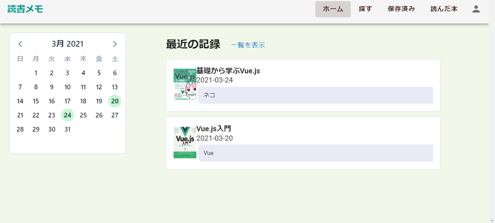
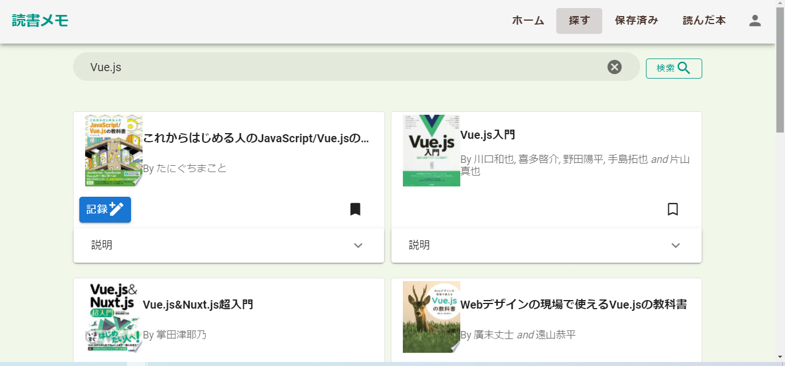
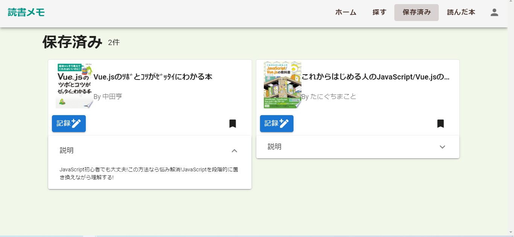
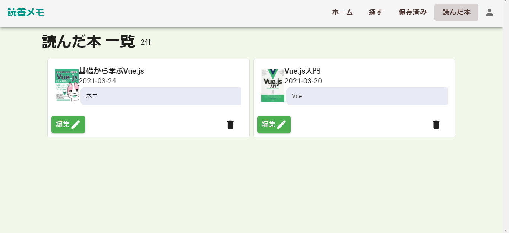

# 読書メモ
読書習慣をつけたい人、読書を振り返りたい人のための  シンプルな『読書記録アプリ』です。 
探す→保存→記録の3ステップで、自分だけの読書記録を残せます。 
(レスポンシブ対応済み) 

# 作成した目的
読書をただ読んで終わらすのではなく、簡単に自分のメモや感想を残せるものを作りたいと思いました。 
ユーザーが継続しやすいよう、日々の読書量を可視化できる作りになっています。

# 使い方
## ホーム画面
ユーザーのホーム画面です。  
カレンダーで記録した本の確認、最近の記録が表示されます。  

## 検索画面
キーワードを入力し、本を検索できます。  
検索結果から、保存または直接記録することができます。  

## 保存済み画面
検索画面で保存した本の一覧が表示されます。  
気になる本を登録しましょう。  

## 読んだ本一覧画面
読んだ本の一覧が表示されます。  
記録を削除・更新できます。  

# URL
https://reading-memo.xyz

# 使用技術
Vue 2.6.11  
Vuex 3.4.0  
Vue Router 3.2.0  
Vuetify 2.2.11  
Firebase 8.2.3  
HTML/CSS  
JavaScript  
Sass  
Google Books API  

# 機能一覧
- ユーザー認証機能
- 検索機能(Google Books API)
  - ページネーション機能
- 読書メモのCRUD機能
  - カレンダーとの連携機能
  - 最近の投稿機能
  - お気に入り登録・削除
  - 読書メモの投稿・編集・削除
